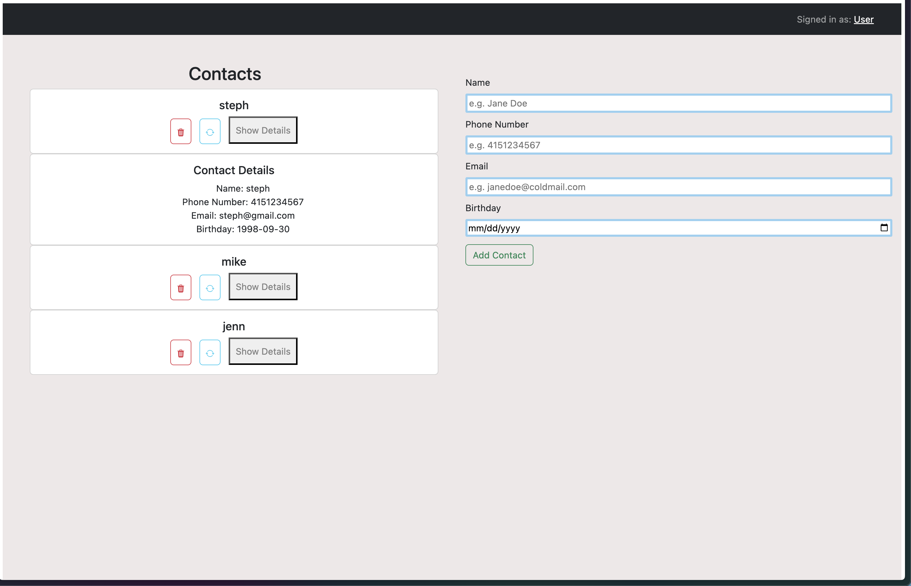

# Contact App

## Overview
The Contact App is an easy-to-use web application that acts as a virtual address book to view, store, update, and delete contacts. This project was created for week 11's Techtonica program assignment. The system uses a React frontend and a Node.js backend to create an interactive UI.

## Screenshot

## Features
- View a list of contacts
- Add new contact
- Edit an existing contact
- Delete a contact
- View additional details for a contact
- Responsive design built with React
- Real-time data synchronization between frontend and backend

## Technologies
### Frontend
- React: JavaScript library for building responsive user interfaces
- React Bootstrap: Styling and layout of the app
- Fetch API: Makes HTTP requests to the backend  
### Backend
- Express.js: A Node.js framework for setting up the server and handling HTTP requests
- Node.js: JavaScript environment used to run the Express server
- Cors: Middleware to handle Cross-Origin Resource Sharing
- Dotenv: Hides sensitive environment variables
- PostgreSQL: Database management system
